<h1 class="auto-style10">ESP32-C3-12F Clock, HTML page, NTP, BLE to phone and more </h1>

<strong><a href="../index.html">Home</a></strong>

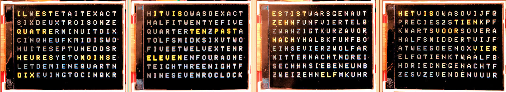

A small clock that displays the time in words in Dutch, English, French and 
German. The clock is able to receive time 
via NTP from the internet.  
Settings can be controlled via a webpage, PC and Bluetooth LE. 
 

<a href="https://github.com/ednieuw/ESP32-C3-Clock-and-more">Latest versions and 
updates on Github</a>  

The clock is built with a ESP32-C3-12F kit. 
The software is written with the Arduino IDE 1.8.19 
and IDE 2.0. 
 
The software contains coding to use the: 
1 ILI9314 colour display 
2 BLE nRF UART connection with a phone with an option to send strings longer than 20 bytes 
3 Time zone corrected time with daylight savings from a NTP server via WIFI 
4 RGBCW LED control on the MCU board 
5 RTC for time keeping when off line 
6 LDR analogue readings&nbsp;and control of display 
intensity 
7 Storage of the settings in the ESP32-C3 SPIFSS Flash memory 
8 Menu driven control of preferences with serial monitor, BLE and WIFI-html page 
9&nbsp;Four languages to display time 
10 SK6812 RGBW /WS2812 RGB LED strip support to make a word clock (in V010 and 
higher)

 
<table class="auto-style12">
<tr>
<td style="width: 248px" valign="bottom"> 
Het was tien over tien 10:13:00 
Il est dix heures et quart 10:14:00 
Il est dix heures et quart 10:15:00 
Het is kwart over tien 10:16:00 
Es war viertel nach zehn 10:17:00 
It was quarter past ten 10:18:00 
Il est dix heures vingt 10:19:00 
Es ist zehn vor halb elf 10:20:00 
Het is tien voor half elf 10:21:00 
It was twenty past ten 10:22:00 
It was twenty past ten 10:23:00 
Het is vijf voor half elf 10:24:00 
Es ist funf vor halb elf 10:25:00 
It is twenty five past ten 10:26:00 
Es war funf vor halb elf 10:27:00 
 
</td>
<td>

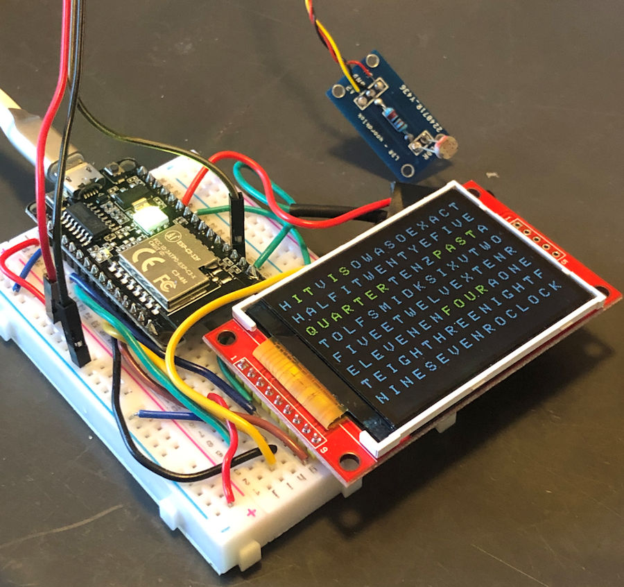</td>
</tr>
<tr>
<td class="auto-style10" colspan="2">Display of the time in the serial output</td>
</tr>
</table>
 

<strong>Introduction</strong> 
The ESP32-C3-12F is a cheap, versatile Micro Computer Unit (MCU).  
Competitors at this moment, end 2022, I have played with are the Arduino MKR1010 
and IOT 33, the Arduino RP2040 Connect and Raspberry Pico W. 
The RP2040 Connect is my favorite while it pins are compatible with the Arduino 
Nano / Every and my designed printed circuit boards (PCB) can still be used., it has a lot a memory and more than enough speed 
for my projects 
A <a href="../Pocuter/PocuterWordClockV.html">kickstarter project</a> using the 
ESP32-C3 with an OLED display forced me to study this architecture.  
A piece of cake was my first thought and I started to convert the word clock 
into the ESP-C3. 
The source code for an Arduino also compiles and uploads with the Arduino IDE 
for the ESP32-C3. 
But almost all libraries are different and changing from 5V and 3.3V was needed.
 
The result is the program below.&nbsp;  
Everything works and the time is displayed in words in the display. 
The program's origin was a <a href="../Bouwpakket/WoordklokWitteLEDs.html">word 
clock running with an ATMEGA328 </a>processor. The software was then converted 
to be used with <a href="../Bouwpakket/WoordklokSK6812.htm">SK6812 RGBW</a> or<a href="../Bouwpakket/Woordklok-Kleur.htm">WS2812 
RGB</a> LED-strips. Time was received with a DCF77 receiver. 
 
This ESP32-C3 program is able to connect to a NTP service on the internet and is 
attached to an ILI9314 display to print the time as text. The ILI9341 colour display is, around €10, very cheap 
but not very fast. For this clock it is not an issue 
Settings can be changed via 
Bluetooth on a phone or with a webpage in a browser.  
In both cases no cloud 
service is used or needed to operate this clock.&nbsp;

<h2 style="width: 840px"><strong>Hardware</strong></h2>

<strong>Materials 
- </strong>ESP32-C3-12F 
- ILI9341 display 
- LDR (Light Dependent Resistor) type GL5516 or GL5528 
- Resistors 1 kOhm, 10 kOhm and optional 22 kOhm 
- 2N2222 or 2N3906 PNP transistor <strong> 
</strong>
- For IOS:&nbsp;
<a href="https://apps.apple.com/nl/app/ble-serial-pro/id1632245655?l=en">BLE 
Serial Pro</a>. (Turn on Fast BLE with option Z in the menu) 
- For Android :
<a href="https://play.google.com/store/apps/details?id=de.kai_morich.serial_bluetooth_terminal">
Serial Bluetooth terminal</a>. (Turn off (default) Fast BLE)

The program 
'ESP32C3-WordClockV010.ino' or newer can be uploaded in the 
ESP32-C3-12F with the Arduino IDE 1.8.19 or newer. The Arduino IDE 2.0.2 
(November 2022) was not able to compile this program due to a bug in the IDE.<strong> 
 
 
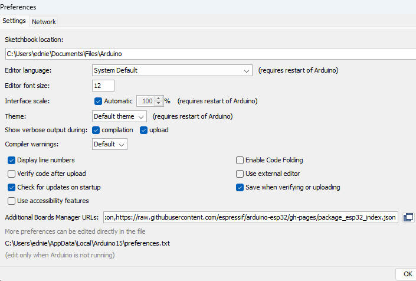</strong>

 
Add the string in Additional Boards Manager URLs in File-&gt; Preference of the IDE<strong> 
</strong>
https://raw.githubusercontent.com/espressif/arduino-esp32/gh-pages/package_esp32_index.json
 
 
Restart the IDE and install the ESP32 boards 
 
Choose the ESP32C3 Dev Module' as board and set the partition scheme to huge'
 
in the IDE menu --&gt; Tools.

<strong>  
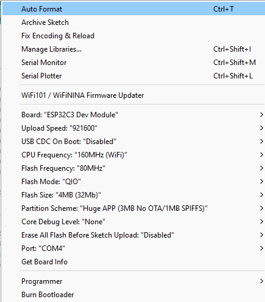 
 
</strong>If the program compiles without errors and uploads into the ESP-C3 the 
hardware can be connected to the board. 
&nbsp;<strong> 
</strong>Connect the DC/RS, RST, MOSI, SCK to respectively GPIO pins 06, 07, 08 and 09. 
MISO is not used because no data comes back from the display.  
CS is connected to GND.  
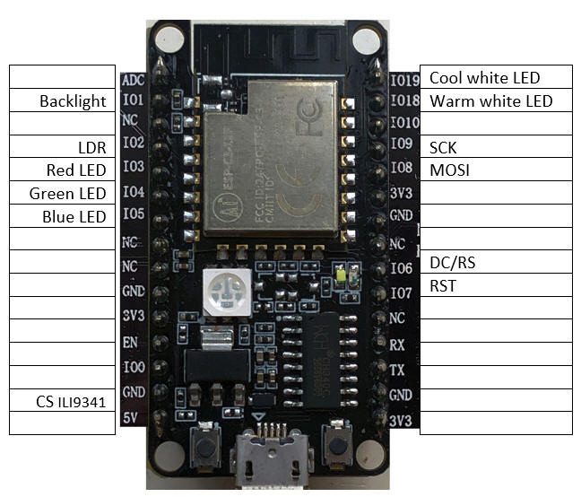 
 
To control the brightness of a connected LED-strip or the back light of the 
display a LDR measures the 
luminosity and dims the LEDs or back light accordingly by PWM on the pin that 
powers the back light or changes the RGBW LED intensity in the software.  
 
If no LDR is attached 
set the minimum light intensity to 250 in the menu and the maximum to 254. 
 
The back light of the ILI9341 uses 50 - 100 mA and the pins of the ESP32-C3-12F 
supply 12mA (or 40mA?). Therefore a 2N2222 PNP transistor is used. A BC327 did 
not work. Probably 3V3 is too less to switch the transistor. A 2N3906 may also 
work. 
Connect the 1 kOhm resistor to pin GPIO 01 that controls the intensity of the 
backlight. 
 
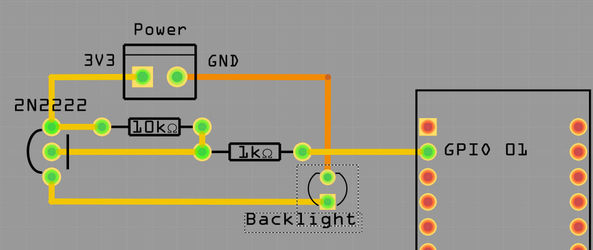 

The LDR is connected via a 10 - 22 
kOhm LDR to ground. The pin A2 is connected to GPIO 02.

With option K in the menu display 
of the LDR readings are printed every second. With the options minimum, maximum 
and slope in the menu the light intensity of the display can be controlled 
 
<a href="https://ednieuw.home.xs4all.nl/Woordklok/LDR/GL55xxLDRs.html">More about the LDR and it types</a> 

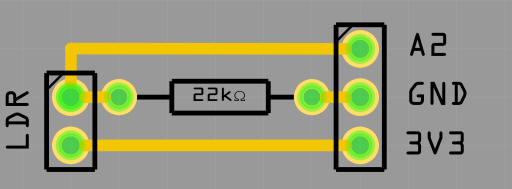

Connecting the LDR to GPIO 00 
failed. The pin did not go low to 0V. It is used for WIFI? 
Almost all&nbsp; the pins are used now. GPIO 03, 04, 05, 18 and 19 are used for the LEDs on 
the MCU. GPIO 20 and 21 are probably used for the serial USB connection.  
&nbsp;  

<strong>First Use 
</strong>When the MCU is started and running properly the LED on the 
board will pulse red every second. 
 
 
When connected to WIFI&nbsp; the same led will also pulse green.&nbsp; 
  
Press the
the top right button to see the ip-address, time and date of the clock .

 
Date and IP-address will disappear as a new minute starts. 
Enter the IP-address in a browser or connect 
via Bluetooth and send the character 'I' to see for the menu. 
In the menu the name of the router to connect to, the SSID, and its password can 
be entered.   
 
 

<strong>Control of the clock</strong>&nbsp;

 
 
If the clock is connected to the internet it will seek contact with a time 
server.   
The time zone is set to UTC+1 Amsterdam but can be changed in the menu. 
To connect to a WIFI network a SSID and password must be entered. 
 
There are a few methods: 
1. Connect the MCU with a serial cable to a PC and use a serial terminal. I 
use the Arduino IDE or <a href="https://www.compuphase.com/software_termite.htm">
Termite</a> as serial terminal. 
 
Sending the I for information will display the menu followed with the actual 
settings of several preferences

<table style="width: 51%" class="auto-style12">
<tr>
<td style="width: 342px">
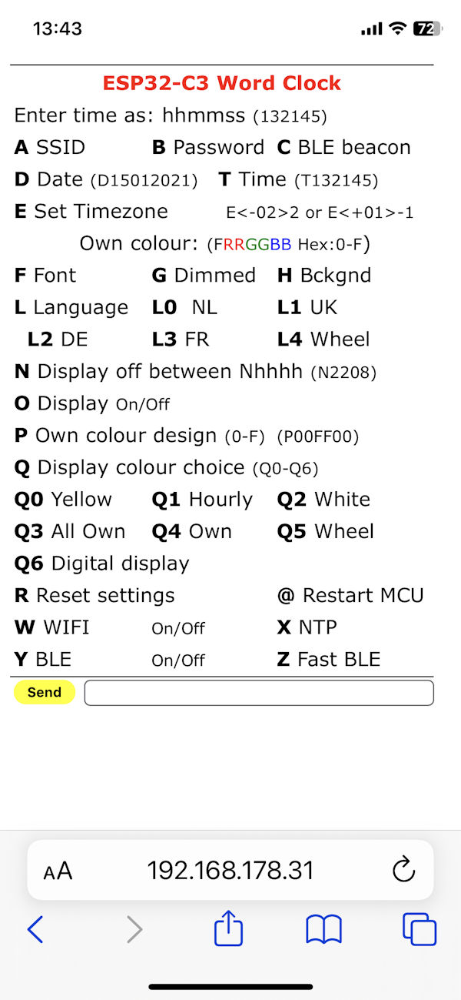</td>
<td style="width: 415px">
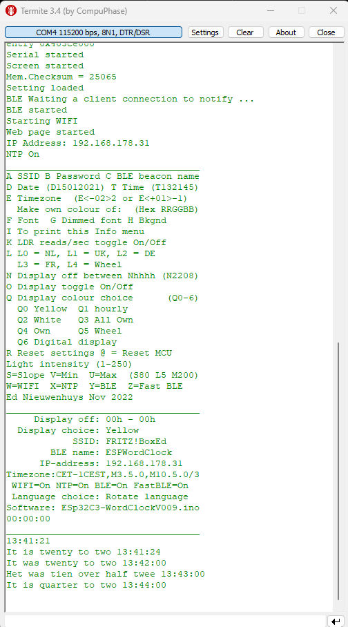</td>
</tr>
<tr>
<td style="width: 342px" class="auto-style10">HTML page on iPhone.</td>
<td style="width: 415px"> 
Termite Terminal on a PC</td>
</tr>
</table>
 

<table style="width: 919px">
<tr>
<td style="width: 550px">

2. USE the BLE nRF connection with an UART serial terminal app 
to control it with your mobile phone or tablet. 
 
Use the IOS app for iPhone or iPad:&nbsp;
<a href="https://apps.apple.com/nl/app/ble-serial-pro/id1632245655?l=en">BLE 
Serial Pro</a>.  
Turn on Fast BLE with option Z in the menu. 
 
For Android use:
<a href="https://play.google.com/store/apps/details?id=de.kai_morich.serial_bluetooth_terminal">
Serial Bluetooth terminal</a>.  
Turn off (default) Fast BLE in the menu.

 Start the 
app and find the MCU in the list of devices and connect to it. You 
can change it's beacon name in the menu with option C. 
 
In both cases 
<strong>send the character I 
of Information and the menu shows up</strong>. 
Enter the first character of the setting you want to changes followed with a code. 
Some entries just toggle On and Off. Like the W to set WIFI Off or On. 
 

To change the SSID and password: 
<strong>A</strong><strong>my-ssid</strong> 
and send this command. Eg AFRITZ!Box01 or aFRITZ!Box01. Starting with an upper 
or lower case character is an identical instruction in the command string 
Then&nbsp; <strong>B</strong><strong>my password</strong> and send that password. 

<strong>Cbroadcastname</strong>&nbsp; will change to name displayed in the Bluetooth 
connection list.&nbsp;   
If the length of the SSID and/or password is less then 5 characters the WIFI 
will be turned off automatically. This will speed up startup time if no internet connection is available 
Use a length of minimal 8 characters for SSID and password. 
Check in the menu (third row from the bottom) if WIFI and NTP are on. 
If WIFI is connected the LED on the MCU will pulse green. 
 Enter @ to reset the 
MCU. It will restart and connections will be made. 
 
To set a time zone. Send the the time zone string between the quotes prefixed with 
the character E or e. 
See the time zones at the bottom of this page. 
For example; if you live in Australia/Sydney send the string, eAEST-10AEDT,M10.1.0,M4.1.0/3

</td>
<td valign="bottom">

&nbsp;

<pre>A SSID B Password C BLE beacon name
D Set Date (D15012021)
E Set Timezone E&lt;-02&gt;2 or E&lt;+01&gt;-1
Make own colour of: (Hex RRGGBB)
F Font G Dimmed font H Bkgnd
I To print this Info menu
L L0 = NL, L1 = UK, L2 = DE
L3 = FR, L4 = Wheel
N Display off between Nhhhh (N2208)
O Display toggle On/Off
Q Display colour choice (Q0-6)
Q0 Yellow Q1 hourly
Q2 White Q3 All Own
Q4 Own Q5 Wheel
Q6 Digital display
R Reset settings @ = Reset MCU
T Set Time (T132145)
W=WIFI, X=NTP, Y=BLE, Z=Fast BLE
Ed Nieuwenhuys Okt 2022
___________________________________
Display off: 00h - 00h
Display choice: Wheel
SSID: FRITZ!BoxEd
BLE name: PocClockBlack
IP-address: 192.168.178.77
Timezone:CET-1CEST,M3.5.0,M10.5.0/3
WIFI=On NTP=On BLE=On Fast BLE=Off
Language choice: Rotate language
Software: ESP32C3WordClockV010.ino
___________________________________</pre>
</td>
</tr>
<tr>
<td style="width: 550px" class="auto-style10">&nbsp;</td>
<td class="auto-style10">Menu shown in serial output.</td>
</tr>
</table>

If there is no WIFI connection time and digital or word clock mode can be set with 
the three buttons.   
Check at the bottom of the menu if WIFI is OFF.  
 
The clock will start much quicker because it 
will not try to connect. 
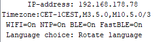

Top 
Left: + 1 hour
Right bottom: + 1 minute
Top Right: Toggle between word or digital display

As mentioned before the clock can be controlled with the WIFI webpage or BLE 
UART terminal app. 
When the clock is connected to WIFI the ip-address is displayed in the Digital display (Press 
Top right button to select it). 
Enter this ip-address numbers and dots (for example: 192.168.178.77) in the browser of your mobile or PC where you type 
your internet addresses (URL). 
or search items. 
Or 
Open the BLE terminal app. Look for the WordClock to connect to and connect. 
BLE connection can be made with my app
<a href="https://ednieuw.home.xs4all.nl/BLESerial/BLESerialPRO.html">BLE Serial 
pro</a> on the
<a href="https://apps.apple.com/nl/app/ble-serial-pro/id1632245655?l=en">app 
store</a> for Apple IOS devices.   
For Android
<a href="https://play.google.com/store/apps/details?id=com.nordicsemi.nrfUARTv2&amp;hl=en&amp;gl=US"> 
&nbsp;nRF UART terminal program </a>and
<a href="https://play.google.com/store/apps/details?id=de.kai_morich.serial_bluetooth_terminal">
Serial Bluetooth terminal from Kai Morich</a>
Unfortunately this Android apps 
can not read strings longer than 20 characters. 
If you see a garbled menu enter and send the character 'Z' to select the slower 
transmission mode 
 

<strong>Settings are set by entering the first character of a command following by 
parameters if necessary.</strong>
For example: To set the colours of the fonts in the display 
to white enter: Q2 
 
To shown random all four languages every minute send L4. 
 
Set the time by entering T130245. (130245 will also work) 
 
Turn off WIFI by sending a W.

Reset the MCU with the character @.

Reset to default setting by send R. 
 
In the BLE connection the SSID and password will be shown. 
  
<table cellspacing="6" class="auto-style2" style="width: auto">
<tr>
<td style="width: 318px">
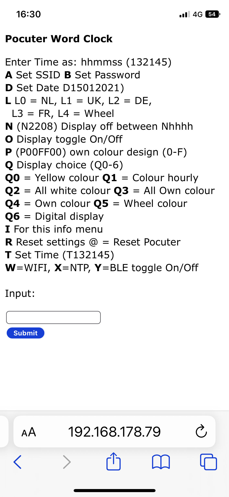</td>
<td>
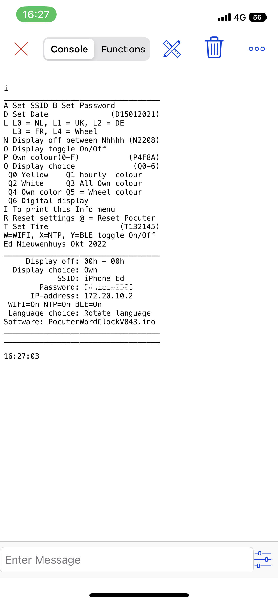</td>
</tr>
<tr>
<td style="width: 318px" class="auto-style10">HTML page</td>
<td class="auto-style10">BLE menu</td>
</tr>
</table>

<strong>Detailed description</strong>

<pre>___________________________________
A SSID B Password C BLE beacon name
D Date (D15012021) T Time (T132145)
E Timezone  (E&lt;-02&gt;2 or E&lt;+01&gt;-1)
  Make own colour of:  (Hex RRGGBB)
F Font  G Dimmed font H Bkgnd
I To print this Info menu
K LDR reads/sec toggle On/Off
L L0 = NL, L1 = UK, L2 = DE
  L3 = FR, L4 = Wheel
N Display off between Nhhhh (N2208)
O Display toggle On/Off
Q Display colour choice      (Q0-6)
  Q0 Yellow  Q1 hourly
  Q2 White   Q3 All Own
  Q4 Own     Q5 Wheel
  Q6 Digital display
R Reset settings @ = Reset MCU
Light intensity (1-250)
S=Slope V=Min  U=Max  (S80 L5 M200)
W=WIFI  X=NTP  Y=BLE  Z=Fast BLE
Ed Nieuwenhuys Nov 2022
___________________________________
     Display off: 00h - 00h
  Display choice: Yellow
            SSID: FRITZ!BoxEd
        BLE name: ESPWordClock
      IP-address: 192.168.178.31
Timezone:CET-1CEST,M3.5.0,M10.5.0/3
 WIFI=On NTP=On BLE=On FastBLE=On
 Language choice: Rotate language
Software: ESp32C3-WordClockV008.ino
16:08:16</pre>

&nbsp;

 
With the menu many preferences can be set.  
These preferences are permanently stored in the ESP32-C3 SPIFFS-storage space. 
&nbsp; 
Enter the first character in the menu of the item to be changed followed with the parameter. 
For most entries upper and lower case are identical 
Between the ( ) 
 

<strong>A SSID B Password C BLE beacon name</strong> 
Change the name of the SSID of the router to be connected to. 
  
aFRITZ!BoxEd or AFRITZ!BoxEd 
Then enter the password. For example: BSecret_pass 
Restart the MCU by sending @  
 
Entering a single 'b' will show the used password. This Easter egg can can used 
to check if a valid password was entered 
 

<strong>D Set Date</strong>&nbsp; and <strong>T Set Time</strong> 
 
If you are not connected to WIFI you have to set the time and date by hand 
For example enter: D06112022 to set the date to 6 November 2022.

Enter for example T132145 (or 132145 , or t132145)&nbsp; to set the time to 45 seconds and 21 minute past 
one o'clock.

<strong>E Set Timezone E&lt;-02&gt;2 or E&lt;+01&gt;-1</strong> 
At the bottom of this page you can find the time zones used in 2022. 
  
It is a rather complicated string and it is therefore wise to copy it. 
Let's pick one if you happen to live here: Antarctica/Troll,"&lt;+00&gt;0&lt;+02&gt;-2,M3.5.0/1,M10.5.0/3" 
Copy the string between the " "'s and send it with starting with an 'E' or 'e' in front. 
E&lt;+00&gt;0&lt;+02&gt;-2,M3.5.0/1,M10.5.0/3

<em>Time zones and daylight savings should be ended and replaced by one universal 
date and time for the while planet cq universe.  
 
But that is my opinion.</em>

<strong>Make own colour of: (Hex RRGGBB) 
F Font G Dimmed font H Bkgnd</strong> 
You can set the colours of the highlighted and dimmed characters and&nbsp; the back ground 
The time is shown with the colour defined with Font when Display choice Q3 or Q4 
is chosen and the rest of the not highlighted characters are coloured with the setting in Dimmed 
font. 
The format to be entered is hexadecimal. 0123456789ABCDEF are the character that 
can be used. 
The command is 2 digits for Red followed with&nbsp; two for Green and ending 
with two digits for Blue.   
To colour the characters intense red enter FF0000 prefixed with the 
character F, G 
or H. 
To set the background to intense blue enter: H0000FF 
To set the dimmed character to dark gray enter for example: G191919. You get 
gray if red, green and blue has the same intensity.

<strong>I To print this Info menu</strong> 
Print the menu to Bluetooth and the serial monitor connected with an USB-cable 

<strong>K LDR reads/sec toggle On/Off 
</strong>Shows the LDR-readings and the calculated intensity output to the 
display 

 

<strong>L L0 = NL, L1 = UK, L2 = DE, L3 = FR, L4 = Wheel</strong> 
You can choose between four languages to display or show them randomly every 
minute. 
 

<strong>N Display off between Nhhhh (N2208)</strong> 
With N2208 the display will be turned off between 22:00 and 8:00. 
 

<strong>O Display toggle On/Off</strong> 
O toggle the display off and on.

 
<strong>Q Display colour choice (Q0-6) 
Q0 Yellow Q1 hourly
Q2 White Q3 All Own
Q4 Own Q5 Wheel
Q6 Digital display</strong> 
 
Q0 will show the time with yellow words. 
Q1 will show every hour another colour. 
Q2 shows all the texts white. 
Q3 and Q4 uses you own defined colours. 
Q5 will follow rainbow colours every minute. 
Q6 is the digital display with the IP-address and date until seconds are 00. 
You can also press the top right button. 
The selected choice is displayed at the bottom of the menu. 
Send an 'I' to display the latest's settings

<strong>R Reset settings </strong>
 
R will set all preferences to default settings, it also clears the SSID and password.

<strong>Light intensity (1-250)</strong><strong> 
</strong><strong>S=Slope V=Min&nbsp; U=Max&nbsp; 
(S100 L5 M200)</strong>

<table style="width: 100%">
<tr>
<td>To control the light intensity three parameters 
can be set. 
The values ranges between 0 and 255 
The minimal light intensity is to avoid that the 
display turns completely off when it is dark. It also prevents flickering when 
the input value are very low.  
Values ranging between 5 and 20 are suggested. When 
no LDR is attached the Min value can be set to 255. 
The maximum light intensity is 255 bits for 100% intensity. 
 
The Slope (sensitivity) controls the speed at with the maximum 
value is reached.  
It multiplies the reading as a percentage. So, entering
100 is a multiplication by one.  
The placement and sensitivity of your LDR can be 
adjusted with this parameter Slope. 
 
</td>
<td>
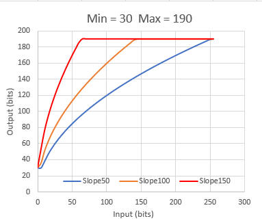 
The effect of the value of the slope on the light intensity of the LEDs 
or display.</td>
</tr>
</table>

<strong>@ = Restart MCU 
</strong>@ will restart the MCU. This is handy when the SSID, et cetera are 
changed and the program must be restarted.

<table style="width: 100%">
	<tr>
		<td>
		<strong>W=WIFI, X=NTP, Y=BLE 
		</strong> 
Toggle WIFI, NTP and BLE on and off. 
		 
Enter the character will toggle it on or off.  
		At the bottom of the menu the 
state is printed.</td>
		<td>
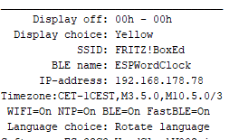</td>
	</tr>
	<tr>
		<td colspan="2">

<strong>Z Fast BLE</strong> 
The
BLE UART protocol sends default packets of 20 bytes. Between every packet there is a delay of 50 
msec 
The IOS BLEserial app, and maybe others too, is able to receive packets of 80 
bytes or more before characters are missed.  
With most apps you will see these will truncate the long strings of the menu.
 
Then turn off Fast BLE.  
 
Option Z toggles between the long and short packages.&nbsp; 
 

Settings are stored in the SPIFFS space from the ESP32-C3

		</td>
	</tr>
</table>

 

<strong>Compilation and uploading</strong>

The settings of the ESP32C3 board is as follows. 
Partition scheme is huge. 
Remember to install the ESP32 boards as explained above in the chapter Materials 

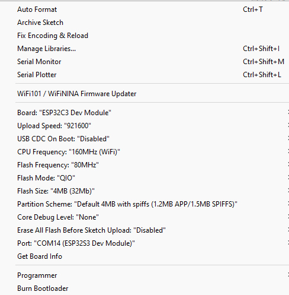

&nbsp;

<strong>Program explanation</strong>

The program uses the following standard libraries.  
 

<pre>// ESP32-C3 Includes defines and initialisations

#include &lt;NimBLEDevice.h&gt;          // For BLE communication https://github.com/h2zero/NimBLE-Arduino
#include &lt;ESPNtpClient.h&gt;          // https://github.com/gmag11/ESPNtpClient
#include &lt;WiFi.h&gt;                  // Used for NTP time and web page
#include &lt;AsyncTCP.h&gt;              // Used for webpage https://github.com/me-no-dev/ESPAsyncWebServer
#include &lt;ESPAsyncWebServer.h&gt;     // Used for webpage https://github.com/me-no-dev/ESPAsyncWebServer
#include &lt;Preferences.h&gt;           // for storage in SPIFFS
#include "Colors.h"                // Definition of the colour list</pre>

Colors.h is included in the program as a TAB in 
the IDE. It contains color names and it associated RGB values 
The other TAB is the web page to display in the 
browser. 
The&nbsp;#include "Webpage.h" to load the webpage is a few lines further in the code  
 
 
I made the web page in the free 'Microsoft Expression Web 4'. It is not 
maintained anymore but has more than enough functionalities for our purposes. 
 
To copy the code from the MS-Expression: 
In the bottom line of the window of MS-Expression click&nbsp;'Split'. 
In the upper half the raw HTML Code is displayed and in the bottom half the 
Design window. 
Copy in the Code window all the HTML 
code  
Go to the Arduino IDE and paste it in the webpage.h TAB between: 
R"rawliteral( &nbsp;... and ...&nbsp;
)rawliteral"; 
 
Or copy the the code from the webpage.h into 
MSexpression Code area and redesign the page as you like

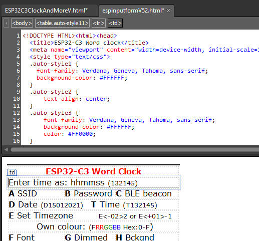 
&nbsp;

A long list if definitions and initialisations follows. 
I am not a fan of passing all the variables to and from functions and like to 
keep them global in one program list. 
If you write a program with other people it is good practice not to use 
too many globals 
but this program is in one large listing, for the same reason to keep it simple. 
I grouped all the variables per application to keep track where they are used. 
With a simple find it is easy in this one great listing to find the back. 
 
To print the time as text and colour with the proper LEDs or characters, the 
words and its position in a string of LEDs or text are defined.  
The defines executes the function ColorLeds with its proper parameters. 
Further in the program&nbsp; in the function void Dutch(void), void 
English(void) et cetera it becomes clear why these defines are so useful and 
handy.&nbsp; 

<pre>...   
#define PRECIES ColorLeds("precies", 16, 22, LetterColor);
#define MTIEN   ColorLeds("tien", 25, 28, LetterColor); 
#define KWART   ColorLeds("kwart", 32, 36, LetterColor); 
#define VOOR    ColorLeds("voor", 38, 41, LetterColor); 
...
</pre>
This is the initialisation of the storage area to 
store the struct EEPROMstorage. 
The Struct with all its settings is saved in one command to permanent memory or 
SD 
Preferences FLASHSTOR; 
 

struct EEPROMstorage { // Data storage in EEPROM to maintain them after power loss 
byte DisplayChoice = 0; 
... 
char BLEbroadcastName[30]; // Name of the BLE beacon 
char Timezone[50]; 
int Checksum = 0; 
} Mem; 
  
 The variables are adressed with a short name Mem.
 For example Mem.DisplayChoice = 3; 
 
The Struct EEPROMstorage 
is stored in the function StoreStructInFlashMemory  and retrieved in the function GetStructFromFlashMemory 
 
  
The menu displayed in the serial monitor and BLE app is defined here. String may not be longer than 40 characters what can be checked with the 'ruler'
 
string. 
<pre>// Menu
//0        1         2         3         4
//1234567890123456789012345678901234567890 
char menu[][40] = {
"A SSID B Password C BLE beacon name",
"D Date (D15012021) T Time (T132145)",
...
"W=WIFI, X=NTP, Y=BLE, Z=Fast BLE", 
"Nov 2022" };</pre>
The Setup happens here:<pre>//--------------------------------------------
// ESP32-C3 Setup
//--------------------------------------------
void setup() 
{
Serial.begin(115200); Tekstprintln("Serial started"); // Setup the serial port to 115200 baud //
...
...
msTick = LastButtonTime = millis(); 
}</pre>
 
The loop is kept almost empty and the program starts 
in Every SeccondCheck. 
There is nothing in this program that should be executes every millisecond or 
less<pre>//--------------------------------------------
// ESP32-C3 Loop
//--------------------------------------------
void loop() 
{
EverySecondCheck();
} </pre>
The following routines check if 
something must happen every second, minute, hour and day. 
This flow handling of the program keeps the processor for 99% free for other 
uses. 
In this program that is almost nothing but for other purposes this can be 
needed. 
Use delays very sparsely.  
In the Bluetooth and Serial communication functions some short delays are used 
that are essential  
here but the program only runs here when there is an actual&nbsp; communication. 
(An alternative method could have been the use of an interrupt every second and 
an empty loop) 
 
Writing or reading to ports consumes a lot of processor time 
To let the LEDs flash like a heartbeat. 
With %100==0 the port is written every 100 msec. 
The LEDs are very bright therefore only a maximum of 12 bits of the 255 are send 
to the LED.

<pre>//--------------------------------------------
// CLOCK Update routine done every second
//--------------------------------------------
void EverySecondCheck(void)
{
static int lumi=0;
(msLeap&gt;500?lumi=(1000-msLeap)/40:lumi=msLeap/40);                       
if (msLeap%100==0){ SetStatusLED(-1,-1,12-lumi,lumi*WIFIConnected,-1); } 
... 
if (timeinfo.tm_min != lastminute) EveryMinuteUpdate(); // Enter the every minute routine after one minute
...
}
//--------------------------------------------
// CLOCK Update routine done every minute
//-------------------------------------------- 
void EveryMinuteUpdate(void)
{
...
if(timeinfo.tm_hour != lasthour) EveryHourUpdate();
}
//--------------------------------------------
// CLOCK Update routine done every hour
//--------------------------------------------
void EveryHourUpdate(void)
{
...
if (timeinfo.tm_mday != lastday) EveryDayUpdate(); 
}
// //
//------------------------------------------------------------------------------
// CLOCK Update routine done every day
//------------------------------------------------------------------------------
void EveryDayUpdate(void)
{
...
}</pre>
 
Check for serial input from the serial monitor and 
pass the command to ReworkInputString()&nbsp; 
<pre>//--------------------------------------------
// Common check for serial input
//--------------------------------------------
void SerialCheck(void)
{
...
ReworkInputString(SerialString+"\n"); // Rework ReworkInputString();
...
}</pre>
 Restore all the default 
values.<pre>//------------------------------------------------------------------------------
// Common Reset to default settings
//------------------------------------------------------------------------------
void Reset(void)
{
Mem.Checksum = 25065;
...
}</pre>
Common common print routines. 
To keep all the print commands in one places it is easy to change these routines 
for other boards with a different 'slang'. 
<pre>//--------------------------------------------
// Common common print routines
//--------------------------------------------
void Tekstprint(char const tekst[]) { if(Serial) Serial.print(tekst); SendMessageBLE(tekst);sptext[0]=0; } 
void Tekstprintln(char const tekst[]) { sprintf(sptext,"%s\n",tekst); Tekstprint(sptext); }
void TekstSprint(char const tekst[]) { printf(tekst); sptext[0]=0;} // printing for Debugging purposes in serial monitor 
void TekstSprintln(char const tekst[]){ sprintf(sptext,"%s\n",tekst); TekstSprint(sptext); }
//------------------------------------------------------------------------------
// Common Constrain a string with integers
// The value between the first and last character in a string is returned between the low and up bounderies
//------------------------------------------------------------------------------
int SConstrainInt(String s,byte first,byte last,int low,int up){return constrain(s.substring(first, last).toInt(), low, up);}
int SConstrainInt(String s,byte first, int low,int up){return constrain(s.substring(first).toInt(), low, up);}

</pre>
The setup of storage space and control of the 
validity of the settings. 
In the checksum is invalid a reset() will restore the default settings<pre>//--------------------------------------------
// Common Init and check contents of EEPROM
//--------------------------------------------
void InitStorage(void)</pre>
Store and retrieve the settings from SPIFFS or SD or 
EEPROM 
the several possibilities are store here. EEPROM becomes outdated but still 
works.<pre>--------------------------------------------
// COMMON Store mem.struct in FlashStorage or SD
//--------------------------------------------
void StoreStructInFlashMemory(void)
{
}
//--------------------------------------------
// COMMON Get data from FlashStorage Preferences.h
//--------------------------------------------
void GetStructFromFlashMemory(void)
{
}</pre>
Get the commands from the strings entered in the 
serial monitor, Bluetooth or the webpage 
and perform the command in an action. 
The menu letters are almost used but it possible to distinguish between lower 
and uppercase when more commands are needed. 
(That is why there is no conversion to UpperCase or LowerCase).<pre>/--------------------------------------------
// CLOCK Input from Bluetooth or Serial
//--------------------------------------------
void ReworkInputString(String InputString)
{
.... 
switch (InputString[0])
{
case 'A':
case 'a': 
if (InputString.length() &gt;5 )
...</pre>
Read the LDR and divide it with 16 to get the values 
from 0 - 4096 between 0 and 255. 
Not all boards has a 12 bit AD converter like. 
<pre>//--------------------------------------------
// LDR reading are between 0 and 255. 
// ESP32 analogue read is between 0 - 4096 --   is: 4096 / 8
//--------------------------------------------
int ReadLDR(void) {  return analogRead(PhotoCellPin)/16;}</pre>
 
Control the color and intensity of the LED on the 
boards in one command 
-1 leaves the LED unchanged. Values between 0 and 
255.<pre>//--------------------------------------------
// CLOCK Control the LEDs on the ESP32
// -1 leaves intensity untouched
//--------------------------------------------
void SetStatusLED(int WW, int CW, int Re, int Gr, int Bl)
{</pre>
 
This function reads the analog port and calculates an 
output intensity to a 
display or LED-strip 
The readings are squared to get a hyperbolic curve that resembles you eye 
correction for dark and light better than a linear range 
It works wonderfully well. 
 
<pre>//-------------------------------------------- 
// LED Dim the leds measured by the LDR and print values 
// LDR reading are between 0 and 255. The Brightness send to the LEDs is between 0 and 255 
//-------------------------------------------- 
void DimLeds(bool print) { ... } </pre>
 
 

 
Here we print and colour the characters in the 
display or light up to proper LEDs in a String of RGB(W) LEDs. 
The #define executes this functions with the proper parameters for every 
language and prints the texts in the serial connections. 
#define QUARTER ColorLeds("quarter", 32, 38, 
LetterColor);  

 
<pre>//-------------------------------------------- /
/ LED Set color for LED. 
//-------------------------------------------- 
void ColorLeds(char const *Texkst, int FirstLed, int LastLed, uint32_t RGBColor) 
{ }</pre>
 
To convert all characters to uppercase in a character array.<pre>//--------------------------------------------
// COMMON String upper
//--------------------------------------------
void to_upper(char* string)</pre>
<pre>
Every display or strip uses other commands to regulate the brightness
Therefore for all LED/Display commands a function </pre>
<pre>//------------------------------------------------------------------------------ 
// LED Set brightness of backlight 
//------------------------------------------------------------------------------ 
void SetBrightnessLeds(byte Bright) 
{ 
 SetBackLight(Bright); // Set brightness of LEDs 
} 
</pre>
 
A place to turn off all LEDs or clear the display 
<pre>/--------------------------------------------
// LED Clear the character string
//--------------------------------------------
void LedsOff(void) 
</pre>
 
 
Here are all the colours are set for the characters are set. 
The function has changed often and it's name describes it's original purpose 
For backward compatibility it's name is unchanged. 
/-------------------------------------------- 
// LED Set second color 
//-------------------------------------------- 
void SetSecondColour(void) 
{ &nbsp;switch (Mem.DisplayChoice) &nbsp; { &nbsp;case 
DEFAULTCOLOUR: LetterColor = C_YELLOW; 
 
... 
 
 
SWversion() prints the menu and the settings of sevaral preferences 
The function has changed often and it's name describes it's original purpose 
For backward compatibility it's name is unchanged. 
PrintLine() prints the horizontal lines in the menu. 
<pre>//--------------------------------------------
// CLOCK Version and preferences info
//--------------------------------------------
void SWversion(void) 
{ 
#define FILENAAM (strrchr(__FILE__, '\\') ? strrchr(__FILE__, '\\') + 1 : __FILE__)
PrintLine(35);
for (uint8_t i = 0; i &lt; sizeof(menu) / sizeof(menu[0]); Tekstprintln(menu[i++]));
...
PrintLine(35);
}

void PrintLine(byte Lengte)
{... }</pre>
 
Displaytime() prints the time to the serial monitor as text and control wiich 
language is printed. 
It also sends the appropriate sequence of colour and intensities to a RGB(W) LED 
strip.<pre>//--------------------------------------------
// CLOCK Say the time and load the LEDs 
// with the proper colour and intensity
//--------------------------------------------
void Displaytime(void)
{ 
..
switch(Language) // Print all the character in the backgound color, a sort of ClearScreen
{
case 0: 
strncpy(Template,"HETVISOWASOVIJFQPRECIESZSTIENKPFKWARTSVOORSOVERAHALFSMIDDERTVIJFATWEESOEENOXVIERELFQTIENKTWAALFBHDRIECNEGENACHTFZESVZEVENOENVUUR",129); 
ColorLeds(Template,0,127, Mem.DimmedLetter);
Dutch(); Print_tijd(); break;
case 1: 
...
}</pre>
 
A series of functions to get and store time. 
The NTP time server puts the retrieved time in the standard C time structures. 
<pre>/--------------------------- Time functions --------------------------

void GetTijd(byte printit)
void Print_RTC_tijd(void)
void PrintNTP_tijd(void)
void PrintUTCtijd(void)
void Print_tijd(void)
void SetRTCTime(void)

</pre>
Convert a HEX string to a unsigned 32-bits integer 
<pre>/--------------------------------------------
// CLOCK Convert Hex to uint32
//--------------------------------------------
uint32_t HexToDec(String hexString) </pre>
<h2>Functions to let the clocks speak the time in four languages</h2>
There is also a lot of slang in languages.  
'Half nine' sometimes means 8:30 but can also be 9:30. (-: 
 
/-------------------------------------------- 
// CLOCK Dutch clock display 
//-------------------------------------------- 
void Dutch(void) 
{ 
HET; // HET is always on 
switch (timeinfo.tm_min) 
{ 
case 0: IS; PRECIES; break; 
case 1: IS; break; 
case 2:   
case 3: WAS; break; 
case 4:   
case 5:   
... 
 
void English(void) 
void German(void) 
void French(void) 
 
 
The Bluetooth Low Energy Nordic nRF.. functions. 
They are different from the Texas instrument CC2540/CC2541 that is used in other 
chipsets like the HM-10, HM16, JDY-08 et cetera. 
<a href="https://www.instructables.com/Communicate-Using-CC254x-or-NRF-BLE-With-Arduino-a/">More here on Instructables</a> 
 
<pre>/-----------------------------
// BLE SendMessage by BLE Slow in packets of 20 chars
//------------------------------
void SendMessageBLE(std::string Message)

/-----------------------------
// BLE Start BLE Classes
//------------------------------
class MyServerCallbacks: public BLEServerCallbacks 

/-----------------------------
// BLE Start BLE Service
//------------------------------
void StartBLEService(void)

/-----------------------------
// BLE CheckBLE
//------------------------------
void CheckBLE(void)</pre>
 
Functions to start a WIFI connection and use the webpage 
 
<pre>/--------------------------------------------
// WIFI WEBPAGE 
//--------------------------------------------
void StartWIFI_NTP(void)

/--------------------------------------------
// WIFI WEBPAGE 
//--------------------------------------------
void WebPage(void) 

/--------------------------------------------
// WIFI WEBPAGE Not found message
//--------------------------------------------
void notFound(AsyncWebServerRequest *request)
</pre>
 
 

<a href="../../email.html">@Ed Nieuwenhuys</a>, November 2022&nbsp;

&nbsp;

<strong>Time zones</strong>.  
 
Copy the text between the quotes and paste them after the character E 
 

<pre>Africa/Abidjan,"GMT0"
Africa/Accra,"GMT0"
Africa/Addis_Ababa,"EAT-3"
Africa/Algiers,"CET-1"
Africa/Asmara,"EAT-3"
Africa/Bamako,"GMT0"
Africa/Bangui,"WAT-1"
Africa/Banjul,"GMT0"
Africa/Bissau,"GMT0"
Africa/Blantyre,"CAT-2"
Africa/Brazzaville,"WAT-1"
Africa/Bujumbura,"CAT-2"
Africa/Cairo,"EET-2"
Africa/Casablanca,"&lt;+01&gt;-1"
Africa/Ceuta,"CET-1CEST,M3.5.0,M10.5.0/3"
Africa/Conakry,"GMT0"
Africa/Dakar,"GMT0"
Africa/Dar_es_Salaam,"EAT-3"
Africa/Djibouti,"EAT-3"
Africa/Douala,"WAT-1"
Africa/El_Aaiun,"&lt;+01&gt;-1"
Africa/Freetown,"GMT0"
Africa/Gaborone,"CAT-2"
Africa/Harare,"CAT-2"
Africa/Johannesburg,"SAST-2"
Africa/Juba,"CAT-2"
Africa/Kampala,"EAT-3"
Africa/Khartoum,"CAT-2"
Africa/Kigali,"CAT-2"
Africa/Kinshasa,"WAT-1"
Africa/Lagos,"WAT-1"
Africa/Libreville,"WAT-1"
Africa/Lome,"GMT0"
Africa/Luanda,"WAT-1"
Africa/Lubumbashi,"CAT-2"
Africa/Lusaka,"CAT-2"
Africa/Malabo,"WAT-1"
Africa/Maputo,"CAT-2"
Africa/Maseru,"SAST-2"
Africa/Mbabane,"SAST-2"
Africa/Mogadishu,"EAT-3"
Africa/Monrovia,"GMT0"
Africa/Nairobi,"EAT-3"
Africa/Ndjamena,"WAT-1"
Africa/Niamey,"WAT-1"
Africa/Nouakchott,"GMT0"
Africa/Ouagadougou,"GMT0"
Africa/Porto-Novo,"WAT-1"
Africa/Sao_Tome,"GMT0"
Africa/Tripoli,"EET-2"
Africa/Tunis,"CET-1"
Africa/Windhoek,"CAT-2"
America/Adak,"HST10HDT,M3.2.0,M11.1.0"
America/Anchorage,"AKST9AKDT,M3.2.0,M11.1.0"
America/Anguilla,"AST4"
America/Antigua,"AST4"
America/Araguaina,"&lt;-03&gt;3"
America/Argentina/Buenos_Aires,"&lt;-03&gt;3"
America/Argentina/Catamarca,"&lt;-03&gt;3"
America/Argentina/Cordoba,"&lt;-03&gt;3"
America/Argentina/Jujuy,"&lt;-03&gt;3"
America/Argentina/La_Rioja,"&lt;-03&gt;3"
America/Argentina/Mendoza,"&lt;-03&gt;3"
America/Argentina/Rio_Gallegos,"&lt;-03&gt;3"
America/Argentina/Salta,"&lt;-03&gt;3"
America/Argentina/San_Juan,"&lt;-03&gt;3"
America/Argentina/San_Luis,"&lt;-03&gt;3"
America/Argentina/Tucuman,"&lt;-03&gt;3"
America/Argentina/Ushuaia,"&lt;-03&gt;3"
America/Aruba,"AST4"
America/Asuncion,"&lt;-04&gt;4&lt;-03&gt;,M10.1.0/0,M3.4.0/0"
America/Atikokan,"EST5"
America/Bahia,"&lt;-03&gt;3"
America/Bahia_Banderas,"CST6CDT,M4.1.0,M10.5.0"
America/Barbados,"AST4"
America/Belem,"&lt;-03&gt;3"
America/Belize,"CST6"
America/Blanc-Sablon,"AST4"
America/Boa_Vista,"&lt;-04&gt;4"
America/Bogota,"&lt;-05&gt;5"
America/Boise,"MST7MDT,M3.2.0,M11.1.0"
America/Cambridge_Bay,"MST7MDT,M3.2.0,M11.1.0"
America/Campo_Grande,"&lt;-04&gt;4"
America/Cancun,"EST5"
America/Caracas,"&lt;-04&gt;4"
America/Cayenne,"&lt;-03&gt;3"
America/Cayman,"EST5"
America/Chicago,"CST6CDT,M3.2.0,M11.1.0"
America/Chihuahua,"MST7MDT,M4.1.0,M10.5.0"
America/Costa_Rica,"CST6"
America/Creston,"MST7"
America/Cuiaba,"&lt;-04&gt;4"
America/Curacao,"AST4"
America/Danmarkshavn,"GMT0"
America/Dawson,"MST7"
America/Dawson_Creek,"MST7"
America/Denver,"MST7MDT,M3.2.0,M11.1.0"
America/Detroit,"EST5EDT,M3.2.0,M11.1.0"
America/Dominica,"AST4"
America/Edmonton,"MST7MDT,M3.2.0,M11.1.0"
America/Eirunepe,"&lt;-05&gt;5"
America/El_Salvador,"CST6"
America/Fortaleza,"&lt;-03&gt;3"
America/Fort_Nelson,"MST7"
America/Glace_Bay,"AST4ADT,M3.2.0,M11.1.0"
America/Godthab,"&lt;-03&gt;3&lt;-02&gt;,M3.5.0/-2,M10.5.0/-1"
America/Goose_Bay,"AST4ADT,M3.2.0,M11.1.0"
America/Grand_Turk,"EST5EDT,M3.2.0,M11.1.0"
America/Grenada,"AST4"
America/Guadeloupe,"AST4"
America/Guatemala,"CST6"
America/Guayaquil,"&lt;-05&gt;5"
America/Guyana,"&lt;-04&gt;4"
America/Halifax,"AST4ADT,M3.2.0,M11.1.0"
America/Havana,"CST5CDT,M3.2.0/0,M11.1.0/1"
America/Hermosillo,"MST7"
America/Indiana/Indianapolis,"EST5EDT,M3.2.0,M11.1.0"
America/Indiana/Knox,"CST6CDT,M3.2.0,M11.1.0"
America/Indiana/Marengo,"EST5EDT,M3.2.0,M11.1.0"
America/Indiana/Petersburg,"EST5EDT,M3.2.0,M11.1.0"
America/Indiana/Tell_City,"CST6CDT,M3.2.0,M11.1.0"
America/Indiana/Vevay,"EST5EDT,M3.2.0,M11.1.0"
America/Indiana/Vincennes,"EST5EDT,M3.2.0,M11.1.0"
America/Indiana/Winamac,"EST5EDT,M3.2.0,M11.1.0"
America/Inuvik,"MST7MDT,M3.2.0,M11.1.0"
America/Iqaluit,"EST5EDT,M3.2.0,M11.1.0"
America/Jamaica,"EST5"
America/Juneau,"AKST9AKDT,M3.2.0,M11.1.0"
America/Kentucky/Louisville,"EST5EDT,M3.2.0,M11.1.0"
America/Kentucky/Monticello,"EST5EDT,M3.2.0,M11.1.0"
America/Kralendijk,"AST4"
America/La_Paz,"&lt;-04&gt;4"
America/Lima,"&lt;-05&gt;5"
America/Los_Angeles,"PST8PDT,M3.2.0,M11.1.0"
America/Lower_Princes,"AST4"
America/Maceio,"&lt;-03&gt;3"
America/Managua,"CST6"
America/Manaus,"&lt;-04&gt;4"
America/Marigot,"AST4"
America/Martinique,"AST4"
America/Matamoros,"CST6CDT,M3.2.0,M11.1.0"
America/Mazatlan,"MST7MDT,M4.1.0,M10.5.0"
America/Menominee,"CST6CDT,M3.2.0,M11.1.0"
America/Merida,"CST6CDT,M4.1.0,M10.5.0"
America/Metlakatla,"AKST9AKDT,M3.2.0,M11.1.0"
America/Mexico_City,"CST6CDT,M4.1.0,M10.5.0"
America/Miquelon,"&lt;-03&gt;3&lt;-02&gt;,M3.2.0,M11.1.0"
America/Moncton,"AST4ADT,M3.2.0,M11.1.0"
America/Monterrey,"CST6CDT,M4.1.0,M10.5.0"
America/Montevideo,"&lt;-03&gt;3"
America/Montreal,"EST5EDT,M3.2.0,M11.1.0"
America/Montserrat,"AST4"
America/Nassau,"EST5EDT,M3.2.0,M11.1.0"
America/New_York,"EST5EDT,M3.2.0,M11.1.0"
America/Nipigon,"EST5EDT,M3.2.0,M11.1.0"
America/Nome,"AKST9AKDT,M3.2.0,M11.1.0"
America/Noronha,"&lt;-02&gt;2"
America/North_Dakota/Beulah,"CST6CDT,M3.2.0,M11.1.0"
America/North_Dakota/Center,"CST6CDT,M3.2.0,M11.1.0"
America/North_Dakota/New_Salem,"CST6CDT,M3.2.0,M11.1.0"
America/Nuuk,"&lt;-03&gt;3&lt;-02&gt;,M3.5.0/-2,M10.5.0/-1"
America/Ojinaga,"MST7MDT,M3.2.0,M11.1.0"
America/Panama,"EST5"
America/Pangnirtung,"EST5EDT,M3.2.0,M11.1.0"
America/Paramaribo,"&lt;-03&gt;3"
America/Phoenix,"MST7"
America/Port-au-Prince,"EST5EDT,M3.2.0,M11.1.0"
America/Port_of_Spain,"AST4"
America/Porto_Velho,"&lt;-04&gt;4"
America/Puerto_Rico,"AST4"
America/Punta_Arenas,"&lt;-03&gt;3"
America/Rainy_River,"CST6CDT,M3.2.0,M11.1.0"
America/Rankin_Inlet,"CST6CDT,M3.2.0,M11.1.0"
America/Recife,"&lt;-03&gt;3"
America/Regina,"CST6"
America/Resolute,"CST6CDT,M3.2.0,M11.1.0"
America/Rio_Branco,"&lt;-05&gt;5"
America/Santarem,"&lt;-03&gt;3"
America/Santiago,"&lt;-04&gt;4&lt;-03&gt;,M9.1.6/24,M4.1.6/24"
America/Santo_Domingo,"AST4"
America/Sao_Paulo,"&lt;-03&gt;3"
America/Scoresbysund,"&lt;-01&gt;1&lt;+00&gt;,M3.5.0/0,M10.5.0/1"
America/Sitka,"AKST9AKDT,M3.2.0,M11.1.0"
America/St_Barthelemy,"AST4"
America/St_Johns,"NST3:30NDT,M3.2.0,M11.1.0"
America/St_Kitts,"AST4"
America/St_Lucia,"AST4"
America/St_Thomas,"AST4"
America/St_Vincent,"AST4"
America/Swift_Current,"CST6"
America/Tegucigalpa,"CST6"
America/Thule,"AST4ADT,M3.2.0,M11.1.0"
America/Thunder_Bay,"EST5EDT,M3.2.0,M11.1.0"
America/Tijuana,"PST8PDT,M3.2.0,M11.1.0"
America/Toronto,"EST5EDT,M3.2.0,M11.1.0"
America/Tortola,"AST4"
America/Vancouver,"PST8PDT,M3.2.0,M11.1.0"
America/Whitehorse,"MST7"
America/Winnipeg,"CST6CDT,M3.2.0,M11.1.0"
America/Yakutat,"AKST9AKDT,M3.2.0,M11.1.0"
America/Yellowknife,"MST7MDT,M3.2.0,M11.1.0"
Antarctica/Casey,"&lt;+11&gt;-11"
Antarctica/Davis,"&lt;+07&gt;-7"
Antarctica/DumontDUrville,"&lt;+10&gt;-10"
Antarctica/Macquarie,"AEST-10AEDT,M10.1.0,M4.1.0/3"
Antarctica/Mawson,"&lt;+05&gt;-5"
Antarctica/McMurdo,"NZST-12NZDT,M9.5.0,M4.1.0/3"
Antarctica/Palmer,"&lt;-03&gt;3"
Antarctica/Rothera,"&lt;-03&gt;3"
Antarctica/Syowa,"&lt;+03&gt;-3"
Antarctica/Troll,"&lt;+00&gt;0&lt;+02&gt;-2,M3.5.0/1,M10.5.0/3"
Antarctica/Vostok,"&lt;+06&gt;-6"
Arctic/Longyearbyen,"CET-1CEST,M3.5.0,M10.5.0/3"
Asia/Aden,"&lt;+03&gt;-3"
Asia/Almaty,"&lt;+06&gt;-6"
Asia/Amman,"EET-2EEST,M2.5.4/24,M10.5.5/1"
Asia/Anadyr,"&lt;+12&gt;-12"
Asia/Aqtau,"&lt;+05&gt;-5"
Asia/Aqtobe,"&lt;+05&gt;-5"
Asia/Ashgabat,"&lt;+05&gt;-5"
Asia/Atyrau,"&lt;+05&gt;-5"
Asia/Baghdad,"&lt;+03&gt;-3"
Asia/Bahrain,"&lt;+03&gt;-3"
Asia/Baku,"&lt;+04&gt;-4"
Asia/Bangkok,"&lt;+07&gt;-7"
Asia/Barnaul,"&lt;+07&gt;-7"
Asia/Beirut,"EET-2EEST,M3.5.0/0,M10.5.0/0"
Asia/Bishkek,"&lt;+06&gt;-6"
Asia/Brunei,"&lt;+08&gt;-8"
Asia/Chita,"&lt;+09&gt;-9"
Asia/Choibalsan,"&lt;+08&gt;-8"
Asia/Colombo,"&lt;+0530&gt;-5:30"
Asia/Damascus,"EET-2EEST,M3.5.5/0,M10.5.5/0"
Asia/Dhaka,"&lt;+06&gt;-6"
Asia/Dili,"&lt;+09&gt;-9"
Asia/Dubai,"&lt;+04&gt;-4"
Asia/Dushanbe,"&lt;+05&gt;-5"
Asia/Famagusta,"EET-2EEST,M3.5.0/3,M10.5.0/4"
Asia/Gaza,"EET-2EEST,M3.4.4/48,M10.5.5/1"
Asia/Hebron,"EET-2EEST,M3.4.4/48,M10.5.5/1"
Asia/Ho_Chi_Minh,"&lt;+07&gt;-7"
Asia/Hong_Kong,"HKT-8"
Asia/Hovd,"&lt;+07&gt;-7"
Asia/Irkutsk,"&lt;+08&gt;-8"
Asia/Jakarta,"WIB-7"
Asia/Jayapura,"WIT-9"
Asia/Jerusalem,"IST-2IDT,M3.4.4/26,M10.5.0"
Asia/Kabul,"&lt;+0430&gt;-4:30"
Asia/Kamchatka,"&lt;+12&gt;-12"
Asia/Karachi,"PKT-5"
Asia/Kathmandu,"&lt;+0545&gt;-5:45"
Asia/Khandyga,"&lt;+09&gt;-9"
Asia/Kolkata,"IST-5:30"
Asia/Krasnoyarsk,"&lt;+07&gt;-7"
Asia/Kuala_Lumpur,"&lt;+08&gt;-8"
Asia/Kuching,"&lt;+08&gt;-8"
Asia/Kuwait,"&lt;+03&gt;-3"
Asia/Macau,"CST-8"
Asia/Magadan,"&lt;+11&gt;-11"
Asia/Makassar,"WITA-8"
Asia/Manila,"PST-8"
Asia/Muscat,"&lt;+04&gt;-4"
Asia/Nicosia,"EET-2EEST,M3.5.0/3,M10.5.0/4"
Asia/Novokuznetsk,"&lt;+07&gt;-7"
Asia/Novosibirsk,"&lt;+07&gt;-7"
Asia/Omsk,"&lt;+06&gt;-6"
Asia/Oral,"&lt;+05&gt;-5"
Asia/Phnom_Penh,"&lt;+07&gt;-7"
Asia/Pontianak,"WIB-7"
Asia/Pyongyang,"KST-9"
Asia/Qatar,"&lt;+03&gt;-3"
Asia/Qyzylorda,"&lt;+05&gt;-5"
Asia/Riyadh,"&lt;+03&gt;-3"
Asia/Sakhalin,"&lt;+11&gt;-11"
Asia/Samarkand,"&lt;+05&gt;-5"
Asia/Seoul,"KST-9"
Asia/Shanghai,"CST-8"
Asia/Singapore,"&lt;+08&gt;-8"
Asia/Srednekolymsk,"&lt;+11&gt;-11"
Asia/Taipei,"CST-8"
Asia/Tashkent,"&lt;+05&gt;-5"
Asia/Tbilisi,"&lt;+04&gt;-4"
Asia/Tehran,"&lt;+0330&gt;-3:30&lt;+0430&gt;,J79/24,J263/24"
Asia/Thimphu,"&lt;+06&gt;-6"
Asia/Tokyo,"JST-9"
Asia/Tomsk,"&lt;+07&gt;-7"
Asia/Ulaanbaatar,"&lt;+08&gt;-8"
Asia/Urumqi,"&lt;+06&gt;-6"
Asia/Ust-Nera,"&lt;+10&gt;-10"
Asia/Vientiane,"&lt;+07&gt;-7"
Asia/Vladivostok,"&lt;+10&gt;-10"
Asia/Yakutsk,"&lt;+09&gt;-9"
Asia/Yangon,"&lt;+0630&gt;-6:30"
Asia/Yekaterinburg,"&lt;+05&gt;-5"
Asia/Yerevan,"&lt;+04&gt;-4"
Atlantic/Azores,"&lt;-01&gt;1&lt;+00&gt;,M3.5.0/0,M10.5.0/1"
Atlantic/Bermuda,"AST4ADT,M3.2.0,M11.1.0"
Atlantic/Canary,"WET0WEST,M3.5.0/1,M10.5.0"
Atlantic/Cape_Verde,"&lt;-01&gt;1"
Atlantic/Faroe,"WET0WEST,M3.5.0/1,M10.5.0"
Atlantic/Madeira,"WET0WEST,M3.5.0/1,M10.5.0"
Atlantic/Reykjavik,"GMT0"
Atlantic/South_Georgia,"&lt;-02&gt;2"
Atlantic/Stanley,"&lt;-03&gt;3"
Atlantic/St_Helena,"GMT0"
Australia/Adelaide,"ACST-9:30ACDT,M10.1.0,M4.1.0/3"
Australia/Brisbane,"AEST-10"
Australia/Broken_Hill,"ACST-9:30ACDT,M10.1.0,M4.1.0/3"
Australia/Currie,"AEST-10AEDT,M10.1.0,M4.1.0/3"
Australia/Darwin,"ACST-9:30"
Australia/Eucla,"&lt;+0845&gt;-8:45"
Australia/Hobart,"AEST-10AEDT,M10.1.0,M4.1.0/3"
Australia/Lindeman,"AEST-10"
Australia/Lord_Howe,"&lt;+1030&gt;-10:30&lt;+11&gt;-11,M10.1.0,M4.1.0"
Australia/Melbourne,"AEST-10AEDT,M10.1.0,M4.1.0/3"
Australia/Perth,"AWST-8"
Australia/Sydney,"AEST-10AEDT,M10.1.0,M4.1.0/3"
Europe/Amsterdam,"CET-1CEST,M3.5.0,M10.5.0/3"
Europe/Andorra,"CET-1CEST,M3.5.0,M10.5.0/3"
Europe/Astrakhan,"&lt;+04&gt;-4"
Europe/Athens,"EET-2EEST,M3.5.0/3,M10.5.0/4"
Europe/Belgrade,"CET-1CEST,M3.5.0,M10.5.0/3"
Europe/Berlin,"CET-1CEST,M3.5.0,M10.5.0/3"
Europe/Bratislava,"CET-1CEST,M3.5.0,M10.5.0/3"
Europe/Brussels,"CET-1CEST,M3.5.0,M10.5.0/3"
Europe/Bucharest,"EET-2EEST,M3.5.0/3,M10.5.0/4"
Europe/Budapest,"CET-1CEST,M3.5.0,M10.5.0/3"
Europe/Busingen,"CET-1CEST,M3.5.0,M10.5.0/3"
Europe/Chisinau,"EET-2EEST,M3.5.0,M10.5.0/3"
Europe/Copenhagen,"CET-1CEST,M3.5.0,M10.5.0/3"
Europe/Dublin,"IST-1GMT0,M10.5.0,M3.5.0/1"
Europe/Gibraltar,"CET-1CEST,M3.5.0,M10.5.0/3"
Europe/Guernsey,"GMT0BST,M3.5.0/1,M10.5.0"
Europe/Helsinki,"EET-2EEST,M3.5.0/3,M10.5.0/4"
Europe/Isle_of_Man,"GMT0BST,M3.5.0/1,M10.5.0"
Europe/Istanbul,"&lt;+03&gt;-3"
Europe/Jersey,"GMT0BST,M3.5.0/1,M10.5.0"
Europe/Kaliningrad,"EET-2"
Europe/Kiev,"EET-2EEST,M3.5.0/3,M10.5.0/4"
Europe/Kirov,"&lt;+03&gt;-3"
Europe/Lisbon,"WET0WEST,M3.5.0/1,M10.5.0"
Europe/Ljubljana,"CET-1CEST,M3.5.0,M10.5.0/3"
Europe/London,"GMT0BST,M3.5.0/1,M10.5.0"
Europe/Luxembourg,"CET-1CEST,M3.5.0,M10.5.0/3"
Europe/Madrid,"CET-1CEST,M3.5.0,M10.5.0/3"
Europe/Malta,"CET-1CEST,M3.5.0,M10.5.0/3"
Europe/Mariehamn,"EET-2EEST,M3.5.0/3,M10.5.0/4"
Europe/Minsk,"&lt;+03&gt;-3"
Europe/Monaco,"CET-1CEST,M3.5.0,M10.5.0/3"
Europe/Moscow,"MSK-3"
Europe/Oslo,"CET-1CEST,M3.5.0,M10.5.0/3"
Europe/Paris,"CET-1CEST,M3.5.0,M10.5.0/3"
Europe/Podgorica,"CET-1CEST,M3.5.0,M10.5.0/3"
Europe/Prague,"CET-1CEST,M3.5.0,M10.5.0/3"
Europe/Riga,"EET-2EEST,M3.5.0/3,M10.5.0/4"
Europe/Rome,"CET-1CEST,M3.5.0,M10.5.0/3"
Europe/Samara,"&lt;+04&gt;-4"
Europe/San_Marino,"CET-1CEST,M3.5.0,M10.5.0/3"
Europe/Sarajevo,"CET-1CEST,M3.5.0,M10.5.0/3"
Europe/Saratov,"&lt;+04&gt;-4"
Europe/Simferopol,"MSK-3"
Europe/Skopje,"CET-1CEST,M3.5.0,M10.5.0/3"
Europe/Sofia,"EET-2EEST,M3.5.0/3,M10.5.0/4"
Europe/Stockholm,"CET-1CEST,M3.5.0,M10.5.0/3"
Europe/Tallinn,"EET-2EEST,M3.5.0/3,M10.5.0/4"
Europe/Tirane,"CET-1CEST,M3.5.0,M10.5.0/3"
Europe/Ulyanovsk,"&lt;+04&gt;-4"
Europe/Uzhgorod,"EET-2EEST,M3.5.0/3,M10.5.0/4"
Europe/Vaduz,"CET-1CEST,M3.5.0,M10.5.0/3"
Europe/Vatican,"CET-1CEST,M3.5.0,M10.5.0/3"
Europe/Vienna,"CET-1CEST,M3.5.0,M10.5.0/3"
Europe/Vilnius,"EET-2EEST,M3.5.0/3,M10.5.0/4"
Europe/Volgograd,"&lt;+03&gt;-3"
Europe/Warsaw,"CET-1CEST,M3.5.0,M10.5.0/3"
Europe/Zagreb,"CET-1CEST,M3.5.0,M10.5.0/3"
Europe/Zaporozhye,"EET-2EEST,M3.5.0/3,M10.5.0/4"
Europe/Zurich,"CET-1CEST,M3.5.0,M10.5.0/3"
Indian/Antananarivo,"EAT-3"
Indian/Chagos,"&lt;+06&gt;-6"
Indian/Christmas,"&lt;+07&gt;-7"
Indian/Cocos,"&lt;+0630&gt;-6:30"
Indian/Comoro,"EAT-3"
Indian/Kerguelen,"&lt;+05&gt;-5"
Indian/Mahe,"&lt;+04&gt;-4"
Indian/Maldives,"&lt;+05&gt;-5"
Indian/Mauritius,"&lt;+04&gt;-4"
Indian/Mayotte,"EAT-3"
Indian/Reunion,"&lt;+04&gt;-4"
Pacific/Apia,"&lt;+13&gt;-13"
Pacific/Auckland,"NZST-12NZDT,M9.5.0,M4.1.0/3"
Pacific/Bougainville,"&lt;+11&gt;-11"
Pacific/Chatham,"&lt;+1245&gt;-12:45&lt;+1345&gt;,M9.5.0/2:45,M4.1.0/3:45"
Pacific/Chuuk,"&lt;+10&gt;-10"
Pacific/Easter,"&lt;-06&gt;6&lt;-05&gt;,M9.1.6/22,M4.1.6/22"
Pacific/Efate,"&lt;+11&gt;-11"
Pacific/Enderbury,"&lt;+13&gt;-13"
Pacific/Fakaofo,"&lt;+13&gt;-13"
Pacific/Fiji,"&lt;+12&gt;-12&lt;+13&gt;,M11.2.0,M1.2.3/99"
Pacific/Funafuti,"&lt;+12&gt;-12"
Pacific/Galapagos,"&lt;-06&gt;6"
Pacific/Gambier,"&lt;-09&gt;9"
Pacific/Guadalcanal,"&lt;+11&gt;-11"
Pacific/Guam,"ChST-10"
Pacific/Honolulu,"HST10"
Pacific/Kiritimati,"&lt;+14&gt;-14"
Pacific/Kosrae,"&lt;+11&gt;-11"
Pacific/Kwajalein,"&lt;+12&gt;-12"
Pacific/Majuro,"&lt;+12&gt;-12"
Pacific/Marquesas,"&lt;-0930&gt;9:30"
Pacific/Midway,"SST11"
Pacific/Nauru,"&lt;+12&gt;-12"
Pacific/Niue,"&lt;-11&gt;11"
Pacific/Norfolk,"&lt;+11&gt;-11&lt;+12&gt;,M10.1.0,M4.1.0/3"
Pacific/Noumea,"&lt;+11&gt;-11"
Pacific/Pago_Pago,"SST11"
Pacific/Palau,"&lt;+09&gt;-9"
Pacific/Pitcairn,"&lt;-08&gt;8"
Pacific/Pohnpei,"&lt;+11&gt;-11"
Pacific/Port_Moresby,"&lt;+10&gt;-10"
Pacific/Rarotonga,"&lt;-10&gt;10"
Pacific/Saipan,"ChST-10"
Pacific/Tahiti,"&lt;-10&gt;10"
Pacific/Tarawa,"&lt;+12&gt;-12"
Pacific/Tongatapu,"&lt;+13&gt;-13"
Pacific/Wake,"&lt;+12&gt;-12"
Pacific/Wallis,"&lt;+12&gt;-12"
Etc/GMT,"GMT0"
Etc/GMT-0,"GMT0"
Etc/GMT-1,"&lt;+01&gt;-1"
Etc/GMT-2,"&lt;+02&gt;-2"
Etc/GMT-3,"&lt;+03&gt;-3"
Etc/GMT-4,"&lt;+04&gt;-4"
Etc/GMT-5,"&lt;+05&gt;-5"
Etc/GMT-6,"&lt;+06&gt;-6"
Etc/GMT-7,"&lt;+07&gt;-7"
Etc/GMT-8,"&lt;+08&gt;-8"
Etc/GMT-9,"&lt;+09&gt;-9"
Etc/GMT-10,"&lt;+10&gt;-10"
Etc/GMT-11,"&lt;+11&gt;-11"
Etc/GMT-12,"&lt;+12&gt;-12"
Etc/GMT-13,"&lt;+13&gt;-13"
Etc/GMT-14,"&lt;+14&gt;-14"
Etc/GMT0,"GMT0"
Etc/GMT+0,"GMT0"
Etc/GMT+1,"&lt;-01&gt;1"
Etc/GMT+2,"&lt;-02&gt;2"
Etc/GMT+3,"&lt;-03&gt;3"
Etc/GMT+4,"&lt;-04&gt;4"
Etc/GMT+5,"&lt;-05&gt;5"
Etc/GMT+6,"&lt;-06&gt;6"
Etc/GMT+7,"&lt;-07&gt;7"
Etc/GMT+8,"&lt;-08&gt;8"
Etc/GMT+9,"&lt;-09&gt;9"
Etc/GMT+10,"&lt;-10&gt;10"
Etc/GMT+11,"&lt;-11&gt;11"
Etc/GMT+12,"&lt;-12&gt;12"
Etc/UCT,"UTC0"
Etc/UTC,"UTC0"
Etc/Greenwich,"GMT0"
Etc/Universal,"UTC0"
Etc/Zulu,"UTC0"</pre>

